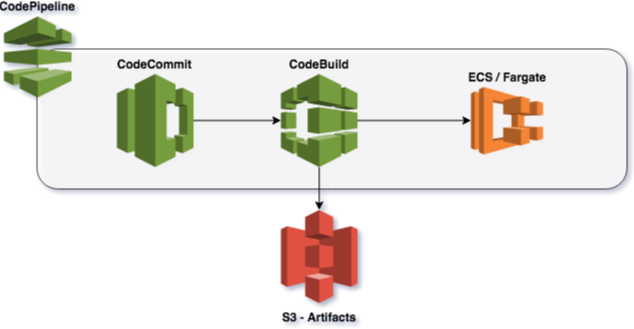

# AWS CI/CD Pipeline sample using ECS (Fargate mode) #

## Description ##

The purpose of this repository is to provide a **basic sample** of an DevOps 
CI/CD pipeline based on AWS components. You can see that as a blueprint.

To deploy this solution we used a Terraform template. When this template will
be applied, you got this:



Ressources will be created in a brand new AWS VPC (with 2 public subnets, 2 
private subnets, in 2 different AZs).

## Using of Terraform for creating the pipeline ##

To create the AWS subsequents resources, we'll use Terraform. Clone this 
repository, and in the terraform directory create a **terraform.tfvars** file 
with :

```
access_key = "YOUR_ACCESS_KEY"
secret_key = "YOUR_SECRET_KEY"
```

Then, you can type these commands:

```bash
  terraform init
  terraform get -update=true
  terraform plan
  terraform apply
```

The "plan" and "apply" operations will ask a confirmation. Resources will be 
only created after the apply operation. "Apply" operation will take some 
minutes to complete, you should go take a coffee ;-)

At the end of the "apply" operation the URL of the load balancer will be 
displayed. After deploying a container, you'll may access to it with this URL.

## Deploy a container ##

Once the pipeline created, you must deploy a new container. Without that, the
application load balancer will target nothing.

If you're curious, you'll also notice an error in the pipeline at the source
stage. That's normal: the source repository is empty and CodePipeline don't
like that.

In order to deploy a new container, you have to push something in the CodeCommit
repository. The only requirement is that the deployed container must expose
something on the port 80/TCP (because the task definition and the ALB are using
this port).

You will find an very basic example in the "code-sample" directory. It's nothing
more than a "hello-world".

## TODO ##

CodeDeploy is now able to deploy applications into ECS/Fargate in Blue/Green mode, 
this template will be soon update to implement this feature.

